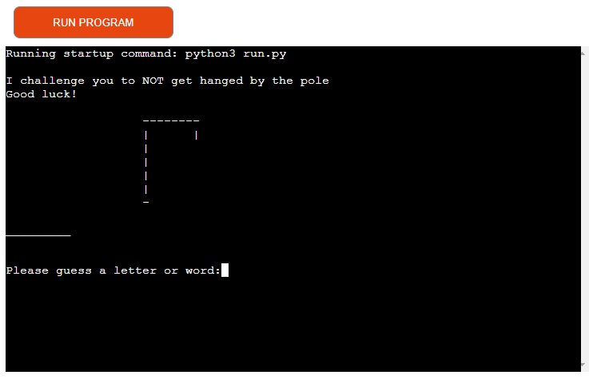
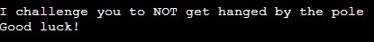

# Hangman the game

This game is all about guessing the word before you get hanged by the pole.

It´s a great game to make the time move a little bit faster and to get that head of yours in training.

I´ve always wanted to know how to create games and work with bugs/ fixes. 

This one was a challenge for me, had some trouble with wrong spelling (I am a Swede).
Learned the hard way how to implement text for the game and how to run it.

Hope you will have a good time guessing those words for the game, HINT (some inspirations comes from Code insitute :) )

## Features 

### Existing Features

- __Main game__

  - I am going for an easy layout here, just wanted to get the game going and finish in time (I have to balance a private life, I am becoming a father anytime now).
  - What you see here is what you get (almost, theres more to it when you play). 
  

- __Game challenge text__
 
  - This text section encourage you to play the game of hangman, this game is a bit toxic in the textcontent to make you wanna beat it.
  - It ends the sentence with a "Good luck!" to finish off that toxic feel.

- __Game section__

  - This is the "graphic" section of the game, here you get the lenght of the word (to the left) and the pole with the rope tied to it.
  - The blank wordsection will update with words if guesses are right as the game goes along.

- __Score-section__

  - This section will appear when the game is played. 
  - It will keep track of you score against the computer, you get +1 point for wins, 0 points for draw, and -1 if you loose. 
  - I made it so you won´t see the computers score, what matters is you!

- __Restart button__ 

  - This button will restart the game. 
  - If you wanna be the first one to 100 points, you may want to start over if you on the minus side.
  - When you hover over this it changes color, when you press it changes again.

  

- __Footer__

  - Wrote a small text that explains how to restart the game. 
  - There´s a facebook icon with a small opacity change when hovered ( links to my facebook page). 

-__The Game__

- This is the game design I come up with.

### Features Left to Implement

- Graphics that make your choice vs computers choice to move the classic rock,paper,scissor motion then show results.

## Testing 

I´ve tried this a very large number of times even my friends have played it.
The feedback I usually get is that it´s a nice time consuming game, in the future I should implement some more cool javascripts.

I´ve encountered some small bugs like the scissors wasn´t able to draw because I misspelled the word scissors in my Javascript, I missed the "s" on the end.
When played on mobile-device the "restart-game" button stays white when pushed, but returns to the right color when you push the "sign-buttons".
The "sign-buttons" hover over effect dosen´t work on the mobile device, because you won´t hover with your fingers :) (so not a bugg but not same as browser)

### Validator Testing 

- HTML
  - No errors were returned when passing through the official [W3C validator](https://validator.w3.org/nu/?doc=https%3A%2F%2Fleetzner.github.io%2FJava-Game%2F)
- CSS
  - No errors were found when passing through the official [(Jigsaw) validator](https://jigsaw.w3.org/css-validator/validator?uri=https%3A%2F%2Fleetzner.github.io%2FJava-Game%2F&profile=css3svg&usermedium=all&warning=1&vextwarning=&lang=sv)

### Unfixed Bugs

The computer score dosen´t count, this is not a real bug, I just left it out because I think it ruins my design (the score still counts but dosen´t show up).

## Deployment

This section should describe the process you went through to deploy the project to a hosting platform (e.g. GitHub) 

- The site was deployed to GitHub pages. The steps to deploy are as follows: 
  - In the GitHub repository, navigate to the Settings tab 
  - From the source section drop-down menu, select the Master Branch
  - Once the master branch has been selected, the page will be automatically refreshed with a detailed ribbon display to indicate the successful deployment. 

The live link can be found here - https://leetzner.github.io/Java-Game/

## Credits 

I got a great deal of help with the javascript for the game from the "Clever Programmer" on youtube.
I´ve used his code to build on and implemented my own thought of how I wanted the game to work.

Found a picture that explains the game from Steam (https://steamcommunity.com/sharedfiles/filedetails/?id=798194678).
Icons to the buttons are downloaded from (https://rwest88.github.io/Rock-Paper-Scissors/)
Icon to facebook is downloaded from (https://icons8.com/icons/set/facebook) 
