# Hangman the game

This game is all about guessing the word before you get hanged by the pole.

It´s a great game to make the time move a little bit faster and to get that head of yours in training.

I´ve always wanted to know how to create games and work with bugs/ fixes. 

This one was a challenge for me, had some trouble with wrong spelling (I am a Swede).
Learned the hard way how to implement text for the game and how to run it.

When you play this game it will make you feel like a sibling or bestfriend, the game will mock you and compliment you on the way.

Hope you will have a good time guessing those words for the game, HINT (some inspirations comes from Code insitute :) )

## Features 

### Existing Features

- __Main game__

  - I am going for an easy layout here, just wanted to get the game going and finish in time (I have to balance a private life, I am becoming a father anytime now).
  - What you see here is what you get (almost, theres more to it when you play). 
  

- __Game challenge text__
 
  - This text section encourage you to play the game of hangman, this game is a bit toxic in the textcontent to make you wanna beat it.
  - It ends the sentence with a "Good luck!" to finish off that toxic feel.

- __Game section__

  - This is the "graphic" section of the game, here you get the lenght of the word (to the left) and the pole with the rope tied to it.
  - The blank wordsection will update with words if guesses are right as the game goes along.

- __Guessing section__

  - This text-section encourage you to make a guess, either letter or a word.
  - The guesses you make here will update the word if it´s a right guess.

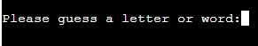

- __Right guess__ 

  - This text will be provided to you if you make a "right-guess" 

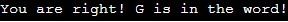

- __Wrong guess__

  - This text will be provided to you if you make a wrong guess 
  - As you can see here the game makes a little evil joke about you "Is a good guess, but not the right one".

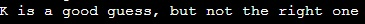

- __Right word guessed__

- When you beat the game it will compliment you as seen in the picture below, and ask you to play another round.
- It will act abit cheeky with the encouragement of asking you to play another round with it (love it)

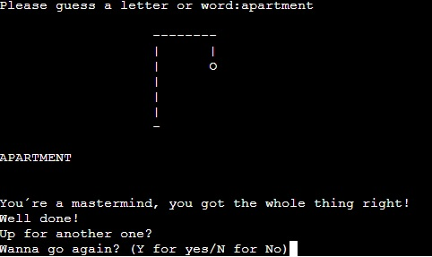

- __Wrong word guessed__

- If the game beats you and you get "hanged by the pole", it will write a toxic comment to make you go look in a dictionary.
- It will present the word that it picked for you and mock with "wanna go again?"

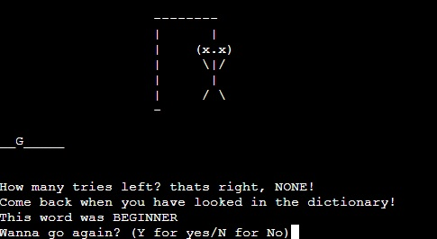

- __Diffren´t stages of the game__

stage 1: head 

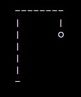 

stage-2: head and body

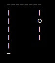

stage-3: head, body and arm

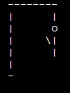

stage-4: head, body and arms

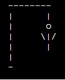

stage-5: head, body, arms and a leg

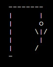

stage-6: head, body, arms and legs

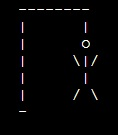

stage-7: head, body, arms, legs and a dead-face

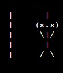

### Features Left to Implement

- In the future I wanna make the game more graphic and not in a "DOS" displayed way.

## Testing 

- When I first started making the game I didn't get it to work more then display the text "You´re a mastermind".

      I googled for help and stumble across this guy namned Caleb who´s working for Kite, and watch a youtube video of him making the game and explaining the diffrent sections of the code.
      
      After I saw this clip I managed to get my coding structure right and it helpt me with the way I could import the words to the game. But I struggle with getting the game to work, I studied my code and his code to compare how it differed from eachothter.

      I found some misspelling on my code on different sections that did´nt make the code react to one another. My fuctions did´nt recieved the right information from the variables.

- When I played the game a couple of times a noticed some small buggs, I had made a wrong back slash on "/n" so it was displayed as "/n" in the game instead of creating a new line.

    I detected some wrongly placed gaps in my texts as seen in picture (notice the spaces before the text on the bottom of the gamescreen): 
    
    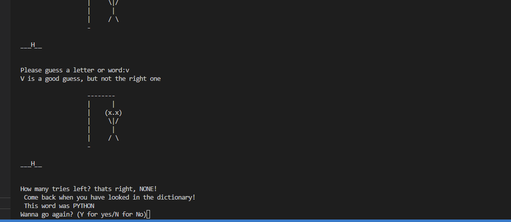

### Validator Testing 

- HTML
  - No errors were returned when passing through the official [W3C validator](https://validator.w3.org/nu/?doc=https%3A%2F%2Fleetzner.github.io%2FJava-Game%2F)
- CSS
  - No errors were found when passing through the official [(Jigsaw) validator](https://jigsaw.w3.org/css-validator/validator?uri=https%3A%2F%2Fleetzner.github.io%2FJava-Game%2F&profile=css3svg&usermedium=all&warning=1&vextwarning=&lang=sv)

## Deployment

This section should describe the process you went through to deploy the project to a hosting platform (e.g. GitHub) 

- The site was deployed to GitHub pages. The steps to deploy are as follows: 
  - In the GitHub repository, navigate to the Settings tab 
  - From the source section drop-down menu, select the Master Branch
  - Once the master branch has been selected, the page will be automatically refreshed with a detailed ribbon display to indicate the successful deployment. 

The live link can be found here - https://leetzner.github.io/Java-Game/

## Credits 

I got a great deal of help with the javascript for the game from the "Clever Programmer" on youtube.
I´ve used his code to build on and implemented my own thought of how I wanted the game to work.

Found a picture that explains the game from Steam (https://steamcommunity.com/sharedfiles/filedetails/?id=798194678).
Icons to the buttons are downloaded from (https://rwest88.github.io/Rock-Paper-Scissors/)
Icon to facebook is downloaded from (https://icons8.com/icons/set/facebook) 
